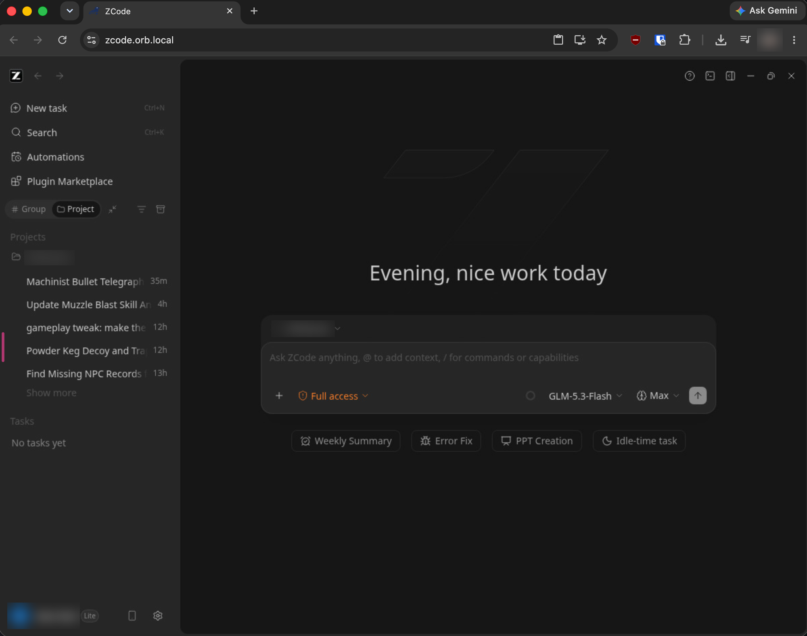

<div align="center">

# zcode-docker-webui

**ZCode in a browser tab, in a container, on your Mac.**

[](LICENSE)
[](https://orbstack.dev)
[](SECURITY.md)

[Quick start](#quick-start) · [API](#openai-compatible-api) · [Settings](#settings) · [Performance](PERF.md) · [Security](SECURITY.md)

<a href="docs/screenshot.png">
  
</a>

<sub>ZCode running at <code>zcode.orb.local</code>. Click to enlarge.</sub>

</div>

**Use ZCode, Z.ai's AI coding agent, from a browser tab without installing it on your Mac, and reuse your Z.ai coding plan from your own scripts through an OpenAI-compatible API.** The agent runs in an isolated container and only sees the folders you give it.

It runs [ZCode](https://zcode.z.ai) in a container on your Mac with [OrbStack](https://orbstack.dev). ZCode's Linux build runs in a browser tab at **https://zcode.orb.local**, works on folders from your Mac at their real paths, and signs in with your Z.ai coding plan. The same login also powers an **OpenAI-compatible API**, so scripts and tools on your Mac can use your plan too.

> [!WARNING]
> **Unofficial and unsupported in every way.** This project is not affiliated with, endorsed by or supported by Z.ai, ZCode, OrbStack or Selkies. It relies on undocumented internals of ZCode, including its bundled CLI and credential store, which any update can break without notice. Using your Z.ai plan through it, especially through the API, may fall outside Z.ai's terms. Check them yourself. No help, fixes or compatibility are promised. Use it entirely at your own risk.

> [!CAUTION]
> **Local use only. Never expose this to the internet as it is.** The browser desktop has no authentication, and whoever reaches it controls an AI agent with a shell and write access to your mounted projects. The API has no key by default and spends your plan. Don't publish its ports, port-forward them, put it behind a public reverse proxy, or tunnel it out (ngrok, Cloudflare Tunnel, Tailscale Funnel and the like). Read [SECURITY.md](SECURITY.md) before you use it.

## Features

| | |
|---|---|
| **ZCode in a browser tab** | The full desktop app, streamed by [Selkies](https://github.com/selkies-project/selkies) and tuned for low CPU. An XQuartz window is optional |
| **Your projects, same paths** | Folders are mounted at the path they have on the Mac, and edits sync both ways instantly |
| **OpenAI-compatible API** | `https://zcode.orb.local/api/v1`, with streaming, using the desktop's login. See [OpenAI-compatible API](#openai-compatible-api) |
| **Your toolchain** | Add apt and npm packages or setup scripts in `packages/`. A change rebuilds in seconds |
| **One command** | `./run.sh` starts, updates or leaves alone, whichever is needed, and keeps your login |
| **Scriptable** | `zcode-cli` (ZCode's headless CLI) and an optional DevTools Protocol port |
| **Contained, locally** | The agent runs in a Linux VM and only sees what you mount. That protects your Mac, not anything exposed to a network. See [SECURITY.md](SECURITY.md) |

## Quick start

**1. Install OrbStack**

```sh
brew install --cask orbstack
open -a OrbStack
docker context use orbstack
```

Not on OrbStack? See [Running without OrbStack](#running-without-orbstack-linux-docker-desktop). It's untested.

**2. Get this repo and start ZCode on a project**

```sh
git clone https://github.com/ban-red/zcode-docker-webui.git
cd zcode-docker-webui
./run.sh ~/code/myapp
```

The first run builds the image, which takes a few minutes. Later starts take seconds. Your browser opens https://zcode.orb.local when ZCode is ready. In ZCode, open `/Users/you/code/myapp`, the same path as on your Mac.

**3. Log in (first run only)**

1. Click **Login** in ZCode.
2. In this repo, run `./login.sh`. It opens the Z.ai login page in your Mac browser.
3. Log in. The browser then tries to open a `zcode://zai-auth/callback...` URL and can't. Copy that URL from the address bar, or from right-click → Inspect → Console.
4. Paste it into `login.sh`, or press Enter to use your clipboard.

The login is kept in a Docker volume, so it survives restarts, rebuilds and folder changes.

## Projects

Pass one or more folders. Each is mounted at the **same path** inside the container, so ZCode's recent-projects list and any paths in your code stay valid.

```sh
./run.sh ~/code/myapp                    # one project
./run.sh ~/code/myapp ~/code/shared-lib  # several
./run.sh .                               # the current folder
./run.sh                                 # the same folders as last time
./run.sh --none                          # no folders
```

- **To add or remove a folder,** rerun with the full new list. The container is recreated in a few seconds.
- **Settings, login, chat history and the npm cache stay put** in the `/config` volume, separate from your projects.
- **Relative paths** resolve from the directory you ran the command in.
- **Folder list:** `run.sh` records it in `compose.override.yaml`, a generated, git-ignored file, and prints it on every run.
- **Broad folders are refused.** `/`, `/Users`, `/Volumes` and your home folder are rejected, because they would hand the agent `~/.ssh`, `~/.aws` and so on. Mount specific projects, or a parent folder like `~/code`.

### Toolchain

The agent runs commands inside the container, so your tools need to be there too. Edit `packages/` and run `./run.sh`. Only the package layer rebuilds, so it takes seconds.

| File | Contents | Default |
|---|---|---|
| `packages/apt.txt` | Ubuntu packages, one per line | git, ripgrep, jq, curl, less, unzip, python3, build-essential |
| `packages/npm.txt` | Global npm packages (`name` or `name@version`) | `bun` |
| `packages/setup.sh` | Anything else, run as root at build time | empty, with examples for uv and deno |

- **Always present:** `node`, `npm`, `npx` and `corepack`, so `pnpm` and `yarn` download at the version your `package.json` pins. Set the Node major with `NODE_VERSION` (default `24`).
- **Git uses your identity:** your Mac's `user.name` and `user.email` are passed in. Mounted repos are trusted, so git doesn't stop with "dubious ownership" errors.
- **`node_modules` holds binaries for one OS.** Packages like esbuild, swc, sharp and rollup ship native binaries. If the agent runs `npm install` in the container, your Mac's `npm run dev` fails until you reinstall on the Mac, and the reverse is also true. Pick one side per project for installs and builds.

## OpenAI-compatible API

ZCode doubles as an OpenAI-style chat API at **`https://zcode.orb.local/api/v1`**, so any OpenAI SDK, CLI or tool can use your Z.ai coding plan, with streaming. Each request runs ZCode's own headless CLI inside the container and streams the result back. It's available in browser mode and on by default.

**No extra login.** The API uses the desktop app's Z.ai login. The desktop caches your coding-plan key in its credential store, and on its first request the API runs `zcode-cli-sync`, which points the CLI at that key. Right after a fresh login, send one message in ZCode so the key gets cached.

```sh
curl https://zcode.orb.local/api/v1/models

curl -N https://zcode.orb.local/api/v1/chat/completions \
  -H 'Content-Type: application/json' \
  -d '{"model": "GLM-5.3", "stream": true,
       "messages": [{"role": "user", "content": "Write a haiku about containers"}]}'
```

```python
from openai import OpenAI

client = OpenAI(base_url="https://zcode.orb.local/api/v1", api_key="unused")  # or your ZCODE_API_KEY
stream = client.chat.completions.create(
    model="GLM-5.3-Flash",
    stream=True,
    messages=[{"role": "user", "content": "hello"}],
)
for chunk in stream:
    if chunk.choices:
        print(chunk.choices[0].delta.content or "", end="")
```

| Endpoint | Supports |
|---|---|
| `GET /api/v1/models` | The plan's models: `GLM-5.3`, `GLM-5.3-Flash` |
| `POST /api/v1/chat/completions` | `stream`, `stream_options.include_usage`, `reasoning_effort` (`low`, `medium`, `high`, `xhigh`, `max`; default `high`), text and base64 `image_url` parts |
| `POST /api/v1/completions` | The legacy `prompt` form |
| `GET /api/v1/health` | Running and queued request counts |

**How it behaves**

- **A chat endpoint, not raw model access.** All of ZCode's tools are switched off and each run happens in an empty scratch folder, so you get plain text back. ZCode's system prompt still applies, which adds about 4k prompt tokens per request, roughly half of them cached. `temperature`, `max_tokens`, `stop`, `n` and function calling are ignored.
- **Streaming is real.** Tokens arrive as the model produces them, and thinking arrives as `delta.reasoning_content`, the field DeepSeek-style clients read. Each request starts a fresh CLI process, so the first token takes about 8–12 seconds.
- **Conversations.** The `messages` history is flattened into one prompt, with system messages as instructions, and prompts are limited to about 120 KB. Every response includes `"zcode": {"session": "sess_..."}`. Pass that back as `"zcode": {"session": "sess_..."}` and ZCode resumes its own session. Only the messages after the last assistant reply are sent.
- **Models.** Unknown model names get a 404. To use any other provider configured in ZCode, pass `"<providerId>/<modelId>"`, or set `ZCODE_API_PROVIDER` for a team plan.
- **Load.** `ZCODE_API_CONCURRENCY` (default 2) caps parallel runs, and further requests wait in a queue. A client that disconnects stops its run.
- **Who can call it.** Anything that can reach `zcode.orb.local`: your Mac and other OrbStack containers. Web pages are refused unless their origin is listed in `ZCODE_API_ORIGINS`. To require a key, set `ZCODE_API_KEY`.

**Agent mode (opt-in).** With `ZCODE_API_AGENT=1`, a request can run the full agent on a mounted project: `"zcode": {"cwd": "/Users/you/code/myapp", "mode": "edit", "tools": true}`. `mode` is `build`, `edit`, `plan` or `yolo`. That gives callers the agent's shell access to your projects, so read [SECURITY.md](SECURITY.md) #12 and set `ZCODE_API_KEY` first.

**The CLI directly.** `docker exec -it zcode zcode-cli --help` covers one-shot prompts (`-p`), NDJSON events (`--output-format stream-json`), session resume, plugins and skills. If it says `Select a model before continuing`, run `docker exec zcode zcode-cli-sync` to link it to the desktop login. `./login.sh --cli` is a fallback that gives the CLI a login of its own.

## Other ways to drive ZCode

**DevTools Protocol.** ZCode is an Electron app. After `ZCODE_CDP=1 ./run.sh`, any Chrome DevTools Protocol client on your Mac can control it:

- **Claude Code / MCP:** `claude mcp add zcode -- npx chrome-devtools-mcp@latest --browser-url=http://zcode.orb.local:9223`
- **Playwright:** `chromium.connectOverCDP('http://zcode.orb.local:9223')`

This is full remote control with no authentication, so turn it on only while you need it (see [SECURITY.md](SECURITY.md) #8).

**XQuartz window.** To run ZCode in its own window instead of a tab:

1. `brew install --cask xquartz`
2. In XQuartz → Settings → Security, check **Allow connections from network clients**, then restart XQuartz.
3. `./run.sh --x11 ~/code/myapp`

The browser tab is faster: XQuartz receives every frame as uncompressed X11 drawing, while the tab streams only what changed. XQuartz mode has its own login volume and no API.

## Running without OrbStack (Linux, Docker Desktop)

> [!WARNING]
> **Untested.** This project has only been tested with OrbStack on macOS. Plain-Docker support exists, and on Linux (Docker Engine) and Docker Desktop it's expected to work, but no one has run it there. Expect rough edges, and read the security notes below first.

Any recent Docker with Compose v2 and BuildKit can run the browser mode. `./run.sh` notices when OrbStack isn't the active Docker and adds `compose.docker.yaml`. That file publishes the desktop and API on **this machine's loopback only**:

- **Desktop:** `http://localhost:3000`. Change the port with `ZCODE_PORT`.
- **API:** `http://localhost:3000/api/v1`.
- **DevTools (with `ZCODE_CDP=1`):** `http://localhost:9223`. Change the port with `ZCODE_CDP_PORT`.

How it differs from OrbStack:

- **No `zcode.orb.local`, and no HTTPS.** Use the localhost URLs above.
- **Detection.** If `run.sh` guesses the runtime wrong, set `ZCODE_RUNTIME=docker` or `ZCODE_RUNTIME=orbstack` in `.env`.
- **Linux file ownership.** `run.sh` sets `PUID`/`PGID` to your user, so files the agent writes in your projects belong to you. Set them in `.env` to override.
- **Opening links.** `run.sh` and `login.sh` open URLs with `xdg-open`, or print them when it's missing. `login.sh` reads the clipboard with `wl-paste` or `xclip`; without either, paste the callback URL when asked.
- **XQuartz mode is macOS only.** On Linux, use the browser mode.
- **Other folders are refused.** Besides the macOS ones, `run.sh` won't mount `/home` or `/root`.

Security on plain Docker:

- **Keep the `127.0.0.1:` binding in `compose.docker.yaml`.** A bare `3000:3000` listens on every network interface, and on Linux it also bypasses `ufw`. That would put an unauthenticated desktop and an unkeyed API, both able to drive an agent with a shell, on your network.
- **Linux has no VM boundary.** Docker Desktop and OrbStack run containers inside a VM. Docker Engine on Linux runs them on your host's kernel, so isolation is weaker than SECURITY.md assumes.
- **Never expose it publicly.** Don't run this on a server you reach over the internet, and don't tunnel it out.

## Everyday use

`./run.sh` is safe to run any time:

| Situation | What it does |
|---|---|
| OrbStack isn't running | Starts it |
| ZCode isn't running | Builds if needed, starts it and opens the tab |
| Running, nothing changed | Leaves your session alone. The cached build check takes a few seconds |
| You changed `packages/`, `.env`, folders or `rootfs/` | Rebuilds only what changed while the old container keeps running, then swaps it in. Your tab reconnects by itself |
| Running in the other mode (browser vs. XQuartz) | Replaces it |

```sh
./run.sh --restart    # restart ZCode even if nothing changed
./run.sh --open       # also open a new browser tab
./run.sh --rebuild    # also pull newer base images (Selkies, Ubuntu, Node)
./run.sh --stop       # stop ZCode; login and settings are kept
docker compose logs -f
```

## Settings

Every setting is an environment variable. Copy the documented template, uncomment what you want to change, then run `./run.sh`:

```sh
cp .env.example .env
```

| Variable | Default | Effect |
|---|---|---|
| **Stream** (see [PERF.md](PERF.md)) | | |
| `ZCODE_FPS` | `30` | Frame rate |
| `ZCODE_ENCODER` | `jpeg,h264enc-striped,h264enc` | The first entry is the default; the others can be picked in the Selkies sidebar |
| `ZCODE_JPEG_QUALITY` | `70` | JPEG quality while content moves (Selkies' own default is 40). Higher is sharper, at more CPU. A still screen is repainted at 90 regardless |
| `ZCODE_TURBO` | `false` | Encode every frame: smoother, but much more CPU |
| `ZCODE_SCALE_1X` | `true` | `false` streams at full Retina resolution, sharper but about 4× the work |
| `ZCODE_WIDTH` / `ZCODE_HEIGHT` | `0` | Lock the desktop size (`0` follows the browser window) |
| `ZCODE_AUDIO` | `false` | Stream sound |
| `ZCODE_REDUCED_MOTION` | `1` | Ask ZCode to cut UI animations |
| **API** | | |
| `ZCODE_API` | `1` | `0` turns the API off |
| `ZCODE_API_KEY` | empty | Require `Authorization: Bearer <key>` |
| `ZCODE_API_ORIGINS` | empty | Web origins allowed to call it. Non-browser clients are unaffected |
| `ZCODE_API_AGENT` | `0` | Allow `zcode.cwd`/`mode`/`tools` in requests |
| `ZCODE_API_MODEL` | `GLM-5.3-Flash` | Model used when a request names none |
| `ZCODE_API_REASONING` | `high` | Reasoning level when a request sends no `reasoning_effort` (without it ZCode would use `max`) |
| `ZCODE_API_PROVIDER` | `account:zai-individual-coding-plan` | Provider for bare model names |
| `ZCODE_API_CONCURRENCY` / `ZCODE_API_TIMEOUT` | `2` / `600` | Parallel runs, and seconds before a run is stopped |
| **Container** | | |
| `ZCODE_CPUS` | `4` | CPU ceiling |
| `ZCODE_RUNTIME` | detected | `orbstack` or `docker` (plain Docker, untested) |
| `ZCODE_PORT` / `ZCODE_CDP_PORT` | `3000` / `9223` | Loopback ports for plain Docker only |
| `ZCODE_VERSION` / `NODE_VERSION` | `3.14.4` / `24` | Versions to build |
| `ZCODE_CDP` | `0` | DevTools Protocol on port 9223 |
| `ZCODE_FLAGS` | empty | Extra Electron/Chromium flags |

Stream settings are only starting values. The Selkies sidebar can still change them during a session.

## Troubleshooting

- **`zcode.orb.local` doesn't load:** check that OrbStack is running and that `docker context show` prints `orbstack`.
- **The API answers `Select a model before continuing`:** the desktop isn't logged in, or hasn't cached its coding-plan key yet. Log in to ZCode, send it one message, and retry.
- **The API is slow to start answering:** that's expected. Each request starts the CLI, so the first token takes about 10 seconds.
- **The XQuartz window is blank or missing:** recheck the network-clients setting. To test, run `DISPLAY=:0 /opt/X11/bin/xhost +`, then `xhost -` afterwards (see [SECURITY.md](SECURITY.md) #7).
- **Intel Mac:** supported. The build picks the x64 package automatically.
- **Start completely fresh:**
  ```sh
  ./run.sh --stop
  docker volume rm zcode-docker-webui_zcode-config
  ./run.sh --rebuild
  ```

## Security and performance

Read **[SECURITY.md](SECURITY.md)** before mounting sensitive projects. In short:
- The agent can write to every folder you mount.
- The browser desktop has no authentication.
- The API has no key until you set one.

The stream is encoded on the CPU, because OrbStack has no GPU. The defaults (1× scale, 30 fps, JPEG strips at quality 70, no Turbo, no audio, 4-core cap) keep a visible tab cheap. **[PERF.md](PERF.md)** explains what each setting costs. It also has a section on tuning for sharper text.

## How it's built

| Path | Role |
|---|---|
| `Dockerfile` | Two targets that share one cached ZCode download: `web` (Selkies, the default) and `x11` |
| `compose.yaml`, `.env.example` | The services and every setting |
| `compose.docker.yaml` | Loopback-only ports for plain Docker, added by `run.sh` when OrbStack isn't active |
| `run.sh`, `login.sh` | Start or update, and the login handoff |
| `packages/` | Your toolchain |
| `rootfs/usr/local/bin/zcode` | Launches ZCode with container-friendly Chromium flags |
| `rootfs/usr/local/bin/zcode-cli`, `zcode-cli-sync` | ZCode's headless CLI, and the link to the desktop login |
| `rootfs/usr/local/bin/zcode-api` | The OpenAI-compatible server, served by nginx at `/api/v1/` |
| `rootfs/usr/local/bin/link-catcher`, `zcode-callback` | Route login links from the container to your Mac browser and back |

## License

[MIT](LICENSE). That covers the files in this repository only. ZCode, Selkies, OrbStack and the other software it installs or talks to keep their own licenses and terms.
